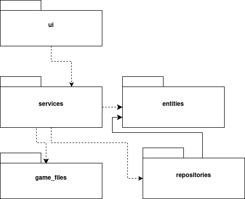

# Arkkitehtuurikuvaus

## Rakenne

Pakkauksessa _ui_ on käyttöliittymästä, _services_ sovelluslogiikasta ja _repositories_ tietojen pysyväistallennuksesta vastaavaa koodia. Pakkaus _entities_ sisältää käyttäjiä kuvaavan luokan. Pakkauksessa _gamefiles_ on pelistä vastaavaa koodia.

## Käyttöliittymä

Käyttöliittymä sisältää viisi näkymää. Näistä kolme on toteutettu UI-luokkina, joista vain yksi on kerrallaan näkyvillä. Ne ovat:
- Kirjautumisnäkymä
- Käyttäjän luomis -näkymä
- Pelin aloitus -näkymä

Tämän lisäksi on kaksi erillistä pygame-näkymää, jotka on toteutettu Render-luokan kautta:
- Pelinäkymä
- Game Over -näkymä

Joko pelinäkymä tai Game Over -näkymä voi olla auki samaan aikaan Pelin aloitus -näkymän kanssa, mutta eri ikkunassa.

Pelinäkymä päivittyy käyttäjän tekemien siirtojen mukaan käyttäen all_sprites.draw -metodia.

Käyttöliittymät on pyritty toteuttamaan erillään sovelluslogiikasta.

## Sovelluslogiikka
Luokka/pakkauskaavio:

##Tietojen pysyväistallennus

UserRepository-luokka huolehtii käyttäjätietojen tallentamisesta. Tiedot tallennettaan SQLite-tietokantaan. Luokat noudattavat Repository-suunnittelumallia.

Sovelluslogiikan testauksessa tiedot tallennetaan keskusmuistiin tietokannan sijaan.

## Päätoiminnallisuudet

### Uuden käyttäjän luominen

Käyttäjä luo uuden käyttäjätunnuksen ja salasanan kirjoittamalla ne annettuihin kenttiin ja sen jälkeen klikkaamalla "Create"-nappia. Napin painaminen kutsuu GameServicen create_user -metodia parametreilla uusi käyttäjätunnus ja uusi salasana. Sovellus tarkistaa ensin UserRepositoryn find_by_username -metodilla, että käyttäjää ei ole vielä olemassa ja luo sitten uuden käyttäjän create-metodilla. Tämän jälkeen käyttöliittymän näkymä vaihtuu create_user_view-näkymästä game_view-näkymään.

### Kirjautuminen

Käyttäjä kirjautuu kirjoittamalla olemassa olevan käyttäjätunnuksen ja salasanan olemassa oleviin kenttiin ja sen jälkeen klikkaamalla "Login"-nappia. Napin painaminen kutsuu Game Servicen login-metodia parametreilla käyttäjätunnus ja salasana. Sovellus tarkistaa ensin UserRepositoryn find_by_username -metodilla, että käyttäjä on olemassa ja sitten, että salasana täsmää. Tämän jälkeen käyttöliittymän näkymä vaihtuu login-näkymästä game_view-näkymään.

### Pelin aloittaminen

Peli aloitetaan painamalla "Start Game"-nappia. Napin painaminen kutsuu GameServicen start-metodia, joka puolestaan kutsuu parametreilla board ja cell_size Game-luokkaa. Pelin alkuvalmistelut tehdään Gamen add_new_ships ja initialize_sprites -metodeilla, jonka jälkeen GameService käynnistää pygame-ikkunan.
