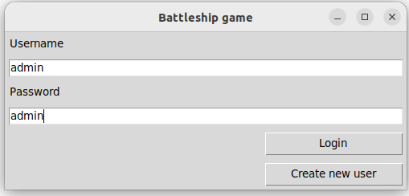
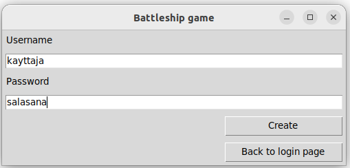
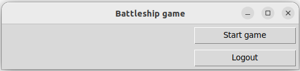
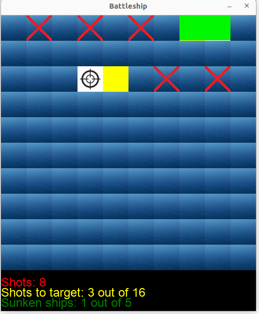
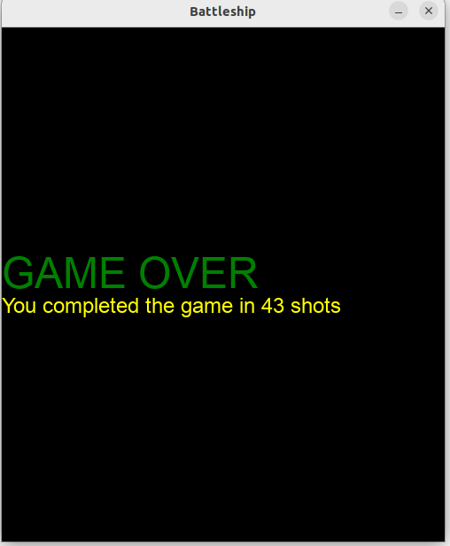

# Käyttöohje

Lataa projektin viimeisimmän version _Source code_ omalle koneelleesi kohdasta [Releases](releases/).

## Konfigurointi

Käyttäjätietojen tallentamiseen käytettävän tietokanta-tiedoston nimen voi konfiguroida _.env_-tiedostossa, joka löytyy päähakemistosta. Tietokanta-tiedosto luodaan _data_hakemistoon. Esimerkki tiedoston nimeämisestä_

```
DATABASE_FILENAME=database.sqlite
```

## Ohjelman käynnistäminen

Asenna riippuvuudet komennolla:

```bash
poetry install
```

Suorita vaadittavat alustustoimenpiteet komennolla:

```bash
poetry run invoke build
```

Aloita ohjelman suoritus komennolla:

```bash
poetry run invoke start
```

## Kirjautuminen

Sovelluksen käynnistyessä avutuu kirjautumisnäkymä, jossa voi kirjautua siään syöttämällä olemassaolevan käyttäjätunnuksen ja salasanan syötekenttiin ja painamalla "Login"-painiketta.



## Uuden käyttäjän luominen

Uuden käyttäjän luomiseen pääsee kirjautumisnäkymästä painamalla "Create new user"-painiketta.

Uusi käyttäjä luodaan syöttämällä uusi, uniikki käyttäjätunnus ja salasana syötekenttiin ja painamalla "Create"-painiketta. Jos käyttäjän luominen onnistuu, siirrytään pelinaloitus-näkymään.

Jos uutta käyttäjää ei luoda, kirjautumisnäkymään voi palata painamalla "Back to login page"-painiketta.



## Pelin aloitus

Peli aloitetaan pelinaloitus-näkymässä painamalla "Start game"-painiketta.

Uloskirjautuminen onnistuu painamalla "Logout"-painiketta.



## Pelaaminen

Pelaaja liikuttaa tähtäintä pelilaudalla nuolinäppäimillä. Siniset solut ovat merialuetta.

Ampuminen tapahtuu painamalla välilyöntiä.

Pelaaja näkee hudit punaisina risteinä, osumat keltaisina soluina ja uponneet laivat vihreinä soluina. Pelilaudan alla on myös kolme laskuria:

 - Kuinka monta kertaa on ammuttu
 - Kuinka moni ammus on osunut kohteeseen
 - Kuinka monta laivaa on upotettu
 

 
## Pelin lopetus
 
Pelin voi lopettaa kesken sulkemalla peli-ikkunan.
 
Kun kaikki laivat on upotettu, näytetään "Game over"-näkymä, jossa kerrotaan kuinka monella ammuksella pelin läpäiseminen tapahtui.
 

