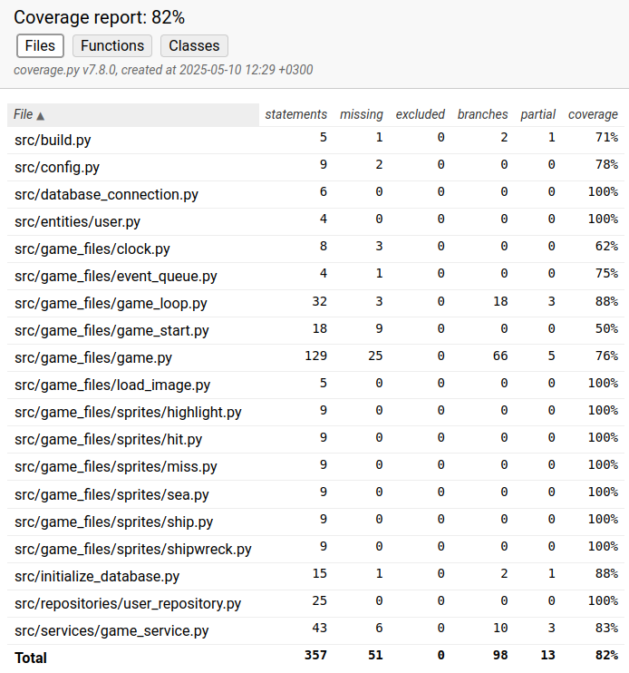

# Testausdokumentti

Järjestelmätason testaus suoritettiin manuaalisesti. Yksikkö- ja integraatiotestausta varten on kirjoitettu automatisoituja unittestejä.

## Yksikkö- ja integraatiotestaus

Testauksesta vastaavat luokat löytyvät [tests](https://github.com/jaahauss/ot-harjoitustyo/blob/master/src/tests/)-kansiosta. Sovelluslogiikan testauksesta vastaavat tiedostot on nimetty logiikalla '(testattava luokka)_test.py'. Repositoria testataan _repository_test.py_-tiedostolla. Tallentamiseen käytettävien tiedostojen nimet on konfiguroitu _.env.test_-tiedostoon

### Testauskattavuus

Harjoitustyön ohjeistuksen mukaan käyttöliittymää ei ole testattu. Testauksen haarautumakattavuus on 82%.

Merkittäviä testaamatta jättäneitä metodeja ovat ampumisesta ja upottamisesta vastaavat metodit, sekä käyttäjän luomisen yrittäminen puuttuvalla käyttäjänimellä tai salasanalla.

### Järjestelmätestaus

Järjestelmätason testaus suoritettiin manuaalisesti.

### Asennus ja konfigurointi

Sovellusta on testattu [käyttöohjeen](./kayttoohje.md) mukaisesti Linux-ympäristössä.

### Toiminnallisuudet

Kaikki [vaatimusmäärittelyssä](./vaatimusmaarittely.md) määritellyt toiminnallisuudet on testattu. Kohdat, joissa vaaditaan syötettä käyttäjältä, on testattu myös virheellisillä syötteillä.

## Sovellukseen jääneet laatuongelmat

Sovellus ei osaa käsitellä virhettä, jossa tietokantaa ei ole alustettu oikein.
