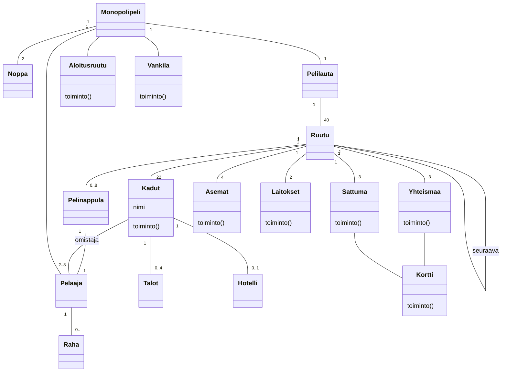

```mermaid
 classDiagram
    Monopolipeli "1" -- "2" Noppa
    Monopolipeli "1" -- "1" Pelilauta
    Pelilauta "1" -- "40" Ruutu
    Ruutu "1" -- "1" Ruutu : seuraava
    Ruutu "1" -- "0..8" Pelinappula
    Pelinappula "1" -- "1" Pelaaja
    Pelaaja "2..8" -- "1" Monopolipeli
    Monopolipeli -- Aloitusruutu
    Monopolipeli -- Vankila
    Ruutu "1" -- "3" Yhteismaa
    Ruutu "1" -- "3" Sattuma
    Ruutu "1" -- "4" Asemat
    Ruutu "1" -- "2" Laitokset
    Ruutu "1" -- "22" Kadut
    Kadut "1" -- "0..4" Talot
    Kadut "1" -- "0..1" Hotelli
    Pelaaja "1" -- "0.." Raha
    Aloitusruutu : toiminto()
    Vankila : toiminto()
    Yhteismaa -- Kortti
    Yhteismaa : toiminto()
    Sattuma -- Kortti
    Sattuma : toiminto()
    Kortti : toiminto()
    Asemat : toiminto()
    Laitokset : toiminto()
    Kadut : nimi
    Kadut : toiminto()
    Kadut -- Pelaaja : omistaja
```
